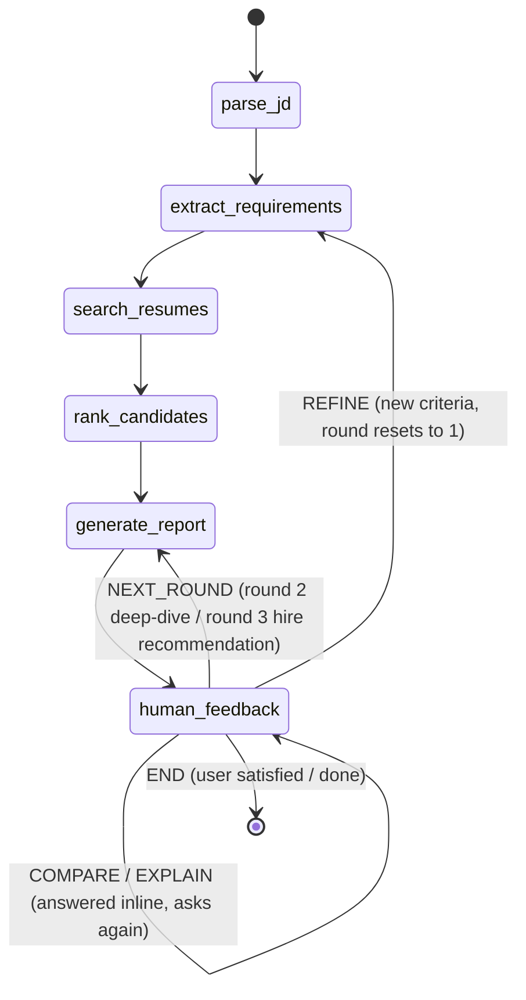

# Agent state machine

## Node responsibilities
- **parse_jd** — takes the first human message as the job description, sets `round = 1`.
- **extract_requirements** — LLM call, splits JD into `must_have` / `nice_to_have`.
- **search_resumes** — hybrid semantic+keyword search (`ai/job_matcher.py`, ported from Milestone 2) against ChromaDB, top-10 for round 1.
- **rank_candidates** — sorts `candidate_pool` by `match_score` into `shortlist`.
- **generate_report** — round-dependent: round 1 = ranked list + reasoning + a ranking-change
  explanation (if this report followed a REFINE) + improvement suggestions for the bottom 2
  ("borderline") candidates, round 2 = LLM head-to-head deep analysis of the shortlist, round 3
  = hire/no-hire recommendation + interview questions for the top candidate.
- **human_feedback** — `interrupt()`s the graph for real user input, classifies intent (REFINE / NEXT_ROUND / COMPARE / EXPLAIN / END) via LLM, routes accordingly. COMPARE/EXPLAIN are answered inline without leaving this node; both resolve which candidates the user means by name first, falling back to ordinal rank ("compare the top 3") against the already rank-ordered shortlist.

## Screening rounds
| round | trigger | behavior |
|---|---|---|
| 1 | initial JD | broad search, top 10 of the full pool |
| 2 | user says "go deeper" / "next round" | `compare_candidates` LLM deep-dive on the 10 |
| 3 | user says "next round" again | hire/no-hire recommendation + interview questions for top pick |
